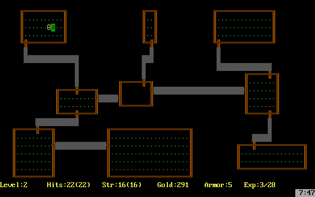

# Project java-rogue

Данный групповой проект реализовывает консольное игровое roguelike-приложение на языке программирования Java с использованием библиотеки JCurses в духе классической игры Rogue 1980 года разработки. Выполнен совместно с @yrelcary и @retroali.

## Содержание
1. [Chapter I](#chapter-i)
   - [Общая информация](#общая-информация)
     - [Rogue 1980](#rogue-1980)
     - [Архитектура приложения](#архитектура-приложения)
2. [Chapter II](#chapter-ii)
   - [Общая характеристика игры](#общая-характеристика-игры)
   - [Сущности игры](#сущности-игры)
   - [Логика](#логика)
     - [Логика игры](#логика-игры)
     - [Логика персонажа](#логика-персонажа)
     - [Логика противников](#логика-противников)
     - [Логика окружения](#логика-окружения)
     - [Логика боя](#логика-боя)
   - [Сгенерированный мир](#сгенерированный-мир)
   - [Вид](#вид)
     - [Отображение](#отображение)
     - [Управление](#управление)
   - [Сохранение прогресса и статистики](#сохранение-прогресса-и-статистики)
3. [Chapter III](#chapter-iii)
   - [Запуск игры](#запуск-игры)
     - [Предварительные требования](#предварительные-требования)
     - [Запуск игры](#запуск-игры-1)
     - [Ручная установка библиотеки Jcurses](#ручная-установка-библиотеки-jcurses)
   - [Групповой проект](#групповой-проект)

       
## Chapter I
## Общая информация

### Rogue 1980




Rogue (разбойник, плут) — компьютерная игра, разработанная в 1980 году компанией Epyx. Ее основной темой является исследование подземелий. Игра была необычайно популярной на университетских Unix-системах в начале 1980-х годов и породила целый жанр, известный как Roguelike (Rogue-подобные игры, т. н. «Рогалики»).

В Rogue игрок выполняет типичную для ранних фэнтезийных ролевых игр роль искателя приключений. Игра начинается на самом верхнем ярусе не нанесенного на карту подземелья с большим количеством монстров и сокровищ. По мере продвижения вглубь случайно сгенерированного подземелья возрастает сила монстров и продвижение усложняется.

Всякий ярус подземелья состоит из сетки 3х3 комнаты или тупикового коридора, в конце которого можно было бы ожидать комнату. В отличие от большинства приключенческих игр того времени, расположение подземелья и расположение объектов в нем генерировалось случайным образом. Таким образом, каждое прохождение игры становилось уникальным и в равной степени рискованным как для новичков, так и для опытных игроков.

У игрока есть 3 характеристики: здоровье, физическая сила и опыт. Все 3 характеристики можно как и увеличить с помощью различных зелий и свитков, так и уменьшить, наступив на ловушку или прочитав проклятый свиток. Большой выбор магических зелий, свитков, волшебных жезлов, оружия, брони и еды приводит к высокому разнообразию игры и различным способам выиграть или проиграть. 

### Архитектура приложения
При реализации проекта используется многослойная архитектура. Разделение представлено так:
- Слой представления (View);
- Слой бизнес-логики (Domain);
- Слой доступа к данным (DataLayer). 

Так, в слое **view** находится код, который организовывает логику отображения на экране пользователя и ввод пользовательских данных. В этом слое отражено взаимодействие с компонентами библиотеки JCurses и Domain-уровнем. 

Слой **domain** отражает бизнес-логику приложения, не связанную с фреймворками. В текущем проекте это определение логики сущностей, связанных с игрой — сама игра, игрок, противник, уровни, карта и другие, а также логика игрового процесса. Так, местоположение игрока и логика изменения его положения в числовых характеристиках на карте отражены в этом слое и затем переданы для отображения в *view*-слой.

Для удобной организации взаимодействия между слоями использовалась практика **MVC**, где слои логики (**domain**) связываются со слоями представления (**view**) при помощи специального «связочного» служебного слоя **controller**.

Слой **datalayer** в приложении отвечает за работу с данными. В данном случае — за хранение истории прошлых игр, а также хранение данных о текущей игровой сессии.

## Chapter II

## Общая характеристика игры

Игровое приложение:
 - реализовано на языке Java версии 21;
 - имеет консольный интерфейс на базе библиотеки JCurses;
 - управляется с клавиатуры;
 - имеет продуманную, чистую архитектуру с четким разделением на слои;
 - реализовывает логику классической игры Rogue 1980 года с рядом упрощений (конкретные требования к игровым механикам описаны в следующих разделах).

## Сущности игры

В доменном слое описаны основные игровые сущности. Основные сущности:
- Игровая сессия;
- Уровень;
- Комната;
- Коридор;
- Персонаж:
  + максимальный уровень здоровья,
  + здоровье,
  + ловкость,
  + сила,
  + текущее оружие;
- Рюкзак;
- Противник:
  + тип,
  + здоровье,
  + ловкость,
  + сила,
  + враждебность;
- Предмет:
  + тип,
  + подтип,
  + здоровье (количество единиц повышения, для еды),
  + максимальный уровень здоровья (количество единиц повышения, для свитков и эликсиров, вместе с этим повышается и сам уровень здоровья),
  + ловкость (количество единиц повышения, для свитков и эликсиров),
  + сила (количество единиц повышения, для свитков, эликсиров и оружия),
  + стоимость (для сокровищ).

## Логика

### Логика игры
- Игра содержит 21 уровень с подземельями.
- Каждый уровень подземелья состоит из 9 комнат, соединенных коридорами, из любой комнаты по этим коридорам можно попасть в любую другую.
- В каждой комнате могут находиться противники и предметы, за исключением стартовой комнаты.
- Игрок управляет перемещением персонажа, может взаимодействовать с предметами и сражаться с противниками.
- Цель игрока — найти на каждом уровне переход на следующий уровень и, таким образом, пройти 21 уровень.
- На каждом уровне игрок начинает в случайной позиции стартовой комнаты, где гарантированно отсутствуют противники.
- После смерти главного героя состояние игры сбрасывается и все возвращается к началу.
- После любого прохождения (успешного и нет) результат игрока выводится на финальном экране, где указывается имя, количество собранных сокровищ, убитых монстров, съеденной еды, выпитых зелий, прочитанных свитков, совершённых ходов, совершённых атаках, полученных ударов и достигнутый уровень подземелья.
- Также после любого прохождения (успешного или нет) результат игрока фиксируется в таблицу рекордов, где указывается достигнутый уровень подземелья и количество собранных сокровищ и результат игры: убит (и кем), вышел из игры, победил. 
- Вся игра работает в пошаговом режиме (каждое действие игрока запускает действия противников), пока игрок не сделал ход, весь мир стоит в ожидании.

### Логика персонажа
- Характеристика здоровья персонажа показывает его текущий уровень здоровья, и когда здоровье персонажа достигает 0 или становится меньше 0, игра заканчивается.
- Характеристика максимального уровня здоровья должна показывать максимальный уровень здоровья персонажа, который может быть восстановлен путем употребления еды.
- Характеристика ловкости участвует в формуле вычисления вероятности попадания противников по персонажу и персонажа по противникам.
- Характеристика силы должна определяет базовый урон, наносимый персонажем без оружия, а также участвует в формуле вычисления урона при использовании оружия.
- За победу над противником персонажу начисляется количество сокровищ, зависящее от сложности противника.
- Персонаж может поднимать предметы и складывать в свой рюкзак, а затем использовать их.
- Каждый предмет при использовании может изменять одну из характеристик персонажа.
- Достигнув выхода из уровня, персонаж автоматически попадает на следующий уровень.

### Логика противников
- Каждый противник имеет аналогичные игроку характеристики здоровья, ловкости и силы, дополнительно к этому имеет характеристику враждебности.
- Характеристика враждебности определяет расстояние, с которого противник начинает преследовать игрока.
- 6 видов противников: 
  + Зомби (отображение: зеленый z): низкая ловкость; средняя сила, враждебность; высокое здоровье. 
  + Вампир (отображение: красная v): высокая ловкость, враждебность и здоровье; средняя сила. 
  + Привидение (отображение: белый g): высокая ловкость; низкая сила, враждебность и здоровье. Периодически становится невидимым. 
  + Огр (отображение: желтый O): очень высокая сила и здоровье; низкая ловкость; средняя враждебность.
  + Змей-маг (отображение: белая s): очень высокая ловкость; высокая враждебность.
  + Мимик (отображение: белая m): высокая ловкость, низкая сила, высокое здоровье и низкая враждебность. Имитирует предметы и не двигается, пока игрок не приблизится.
- Когда начинается преследование игрока, все монстры двигаются по одному паттерну, кратчайшим путем по соседним клеткам в сторону игрока.
- Если игрок находится в области, когда монстр должен начать его преследовать, но при этом не существует пути к нему, то монстр продолжает двигаться случайным образом по паттерну.

### Логика окружения
- Каждый тип предмета имеет свое значение:
  + сокровища (имеют стоимость, накапливаются и влияют на итоговый рейтинг, можно получить только при победе над монстром);
  + еда (восстанавливает здоровье на некоторую величину);
  + эликсиры (постоянно повышают одну из характеристик: ловкость, силу, максимальное здоровье);
  + свитки (постоянно повышают или снижают одну из характеристик: ловкость, силу, максимальное здоровье);
  + оружие (имеют характеристику силы, при использовании оружия меняется формула вычисления наносимого урона).
- При повышении максимального уровня здоровья сама величина здоровья увеличивается на ту же величину.
- Рюкзак хранит в себе все типы предметов.
- Когда персонаж наступает на предмет, он автоматически должен добавляться в рюкзак, если он неполон (в рюкзаке может храниться максимум 9 предметов каждого типа, кроме оружия (у оружия максимум 5 предметов), сокровища копятся и хранятся в единственной ячейке) и исчезают при попытке взять, если рюкзак полон (защита от жадности).
- Еда, эликсиры, свитки при использовании тратятся.
- Оружие при смене автоматически кладется в рюкзак.
- Каждый уровень подземелья имеет наполнение: 
  + Уровень состоит из комнат.
  + Комнаты соединены коридорами.
  + Комнаты содержат противников и предметы.
  + Противники и персонаж могут перемещаться по комнатам и коридорам.
  + Каждый уровень имеет гарантированный переход на следующий уровень.
  + Выход из последнего уровня завершает игру.

### Логика боя
- Бой вычисляется в пошаговом режиме.
- Атака производится путем перемещения персонажа по направлению к противнику.
- Инициация боя происходит при контакте с врагом.
- Удары просчитываются по очереди, в несколько этапов: 
  + 1 этап расчета удара — проверка на попадание. Проверка на попадание случайна и высчитывается из ловкости бьющего и цели удара.
  + 2 этап — расчет урона. Рассчитывается из силы и модификаторов (оружия).
  + 3 этап — применение урона. Урон вычитается из здоровья. Если здоровье падает до 0 или ниже, то противник или персонаж погибает.
- За победу над противников начисляется случайное количество сокровищ, зависящее от враждебности, силы, ловкости и здоровья противника.

## Сгенерированный мир

- Каждый уровень логически разделен на 9 секций, в каждой из которых случайным образом генерируется комната с произвольным размером и положением.
- Комнаты произвольным образом соединены коридорами. Коридоры имеют свою геометрию, по ним тоже можно ходить.
- На каждом уровне одна комната помечена как стартовая, и еще одна — как конечная. В стартовой комнате начинается игровая сессия, а в конечной располагается блок, при прикосновении к которому игрок перемещается на следующий уровень.

## Вид
Рендеринг игры реализован с использованием JCurses в **view**-слое, используя необходимые сущности **domain**.

### Отображение 
- Рендеринг среды — стены, пол, двери в стене, коридоры между комнатами.
- Рендеринг акторов — персонаж, противники, подбираемые предметы.
- Рендеринг интерфейса — отображение игрового интерфейса (панель статуса, инвентаря, начальное меню, панель с подсказками по управлению).
- Туман войны — зависимость рендеринга сцены от состояния игры:
  + Неизведанные комнаты и коридоры не отображаются.
  + В комнате, в которой находится игрок, отображаются стены, пол, акторы и предметы.
  + Просмотренные комнаты, но в которых не находится игрок, тоже отображаются.

### Управление
- Управление персонажем:
  + Передвижение при помощи клавиш WASD и стрелок.
  + Применение оружия из рюкзака при помощи кнопки h.
  + Применение еды из рюкзака при помощи кнопки j.
  + Применение эликсира из рюкзака при помощи кнопки k.
  + Применение свитка из рюкзака при помощи e.
  + Подсказка по использованию клавиш при помощи ?.
- Любое использование чего-либо из рюкзака приводит к печати списка предметов этого типа на экран с вопросом игроку, что нужно выбрать (1–9).
- При выборе оружия также имеется возможность убрать оружие из рук, не выбрасывая из инвентаря (соответственно, для оружия выбор будет 0–5).


## Сохранение прогресса и статистики
Реализован слой **datalayer**, в котором будет производиться сериализация игрового прогресса игрока в файле ``.ser``.
- Полученная статистика и номер пройденного уровня сохраняется каждый игровой цикл.
- В начальном меню есть выбор начать новую игру или зайти в сохраненную игру по имени игрока
- После перезапуска игры, если игрок хочет продолжить последнюю сохраненную сессию, уровни генерируются в соответствии с сохраненной информацией, а прогресс игрока — полностью восстанавливается (набранные очки, текущие значения характеристик), т. е. восстановлена вся информация об игровой сессии вплоть до расположения отдельных сущностей и их характеристик.
- При завершении игры выводится статистика по текущей игре: : количество сокровищ, достигнутый уровень, количество побежденных противников, количество съеденной еды, количество выпитых эликсиров, количество прочитанных свитков, количество нанесенных и пропущенных ударов, количество пройденных клеток.
- Также сохраняется статистика по всем попыткам прохождений, и при просмотре игроком таблицы лидеров в конце игры отображаются все попытки прохождения (необязательно успешные) и их статус: убит (и кем), вышел из игры, победил.


## Chapter III

## Запуск игры

### Предварительные требования

Для работы игры необходима библиотека JCurses, которая использует нативные компоненты. Инструкция по ее установке будет далее. 
Обязательные требования, без которых проект не запустится:

- Наличие ncurses (обычно уже предустановлен в Linux, но проверьте):
```bash
   # Для Ubuntu/Debian
   sudo apt-get install libncurses5-dev
```

- JDK 21+.
```bash
   # Проверьте версию Java
   java -version 
```
   В выводе должна быть указана версия "21" или выше (например, "21.0.1"). Если установлена другая версия, установите JDK 21.

### Запуск игры

В makefile есть команда для установки библиотеки JСurses.

- Клонируйте репозиторий и перейдите в директорию проекта.
```bash
   git clone git@github.com:Pillow-Sveta/java-rogue.git
   cd java-rogue/src/app 
```

- Выполните команду установки (требуются права sudo для копирования файлов в системные директории). Эта команда:
  + Скачает архив JCurses.
  + Извлечет и переименует нужную версию нативной библиотеки (libjcurses64.so -> libjcurses.so).
  + Скопирует libjcurses.so в системную директорию /usr/java/packages/lib/, где JVM будет искать его по умолчанию. Это избавляет от необходимости вручную прописывать LD_LIBRARY_PATH.
  + Создаст символическую ссылку libncurses.so.5 на вашу текущую версию ncurses (например, libncurses.so.6.3).
```bash
   sudo make lib_install
```

- Соберите и запустите проект.
```bash
  make # или make build
```

### Ручная установка библиотеки Jcurses

Если у вас возникли проблемы с make, выполните шаги вручную.
- Скачайте и распакуйте JCurses.
```bash
   wget https://sourceforge.net/projects/javacurses/files/javacurses/0.9.5b/jcurses-linux-0.9.5b.tar.gz
   tar -xf jcurses-linux-0.9.5b.tar.gz
```

- Установите нативную библиотеку.
``` bash
   # Перейдите в директорию с библиотеками
   cd jcurses/lib

   # Скопируйте 64-битную версию библиотеки под именем, которое ищет JVM
   sudo mkdir -p /usr/java/packages/lib
   sudo cp libjcurses64.so /usr/java/packages/lib/libjcurses.so
```

- Настройте совместимость с ncurses.
Найдите точное название вашей установленной библиотеки ncurses (например, libncurses.so.6.3) в /usr/lib/x86_64-linux-gnu/ и создайте символическую ссылку:
``` bash
   sudo ln -s /usr/lib/x86_64-linux-gnu/libncurses.so.6.3 /usr/lib/x86_64-linux-gnu/libncurses.so.5
```

- Вернитесь в директорию проекта и запустите его.
``` bash
   make   # или make build
```

## Групповой проект

| Участник | Роль | Выполненные задачи и вклад |
| :--- | :--- | :--- |
|  **`@retroali`** | Архитектор, Разработчик ядра и данных | • Проектирование многослойной архитектуры (Domain, DataLayer)<br>• Реализация процедурной генерации подземелий (алгоритмы комнат и коридоров, туман войны)<br>• Разработка основной игровой логики (гейм-loop, смена уровней)<br>• Разработка системы сериализации для сохранения/загрузки игры<br>• Реализация системы сбора статистики и таблицы рекордов |
|  **`@yrelcary`** | Разработчик геймплея и AI |• Проектирование многослойной архитектуры (Domain)<br>• Проектирование и реализация системы сущностей (Entity Component System или OOP-модель)<br> • Реализация логики персонажа игрока (перемещение, характеристики, инвентарь)<br>• Разработка системы предметов (оружие, еда, зелья, свитки) и их механик<br>• Реализация сложной логики противников (6 типов с уникальным AI)<br>• Балансировка игровых характеристик (здоровье, урон, дроп) |
| **`@Pillow-Sveta`** | Разработчик UI/UX, Интегратор | • Проектирование многослойной архитектуры (View)<br>• Интеграция и настройка библиотеки JCurses для отрисовки интерфейса<br>• Реализация системы рендеринга: карта, акторы, панель статуса, меню<br>• Настройка системы сборки (Gradle) и решение проблем с нативными зависимостями<br> • Интеграция модулей, написанных разными участниками, в единую работающую систему<br>• Реализация системы отображения статистики и таблицы рекордов<br> • Сборка и компиляция финальной версии проекта из модулей, разработанных командой <br>• Настройка и разрешение зависимостей между пакетами<br>• Тестирование комплексных сценариев, затрагивающих несколько систем (бой + сохранение + интерфейс)<br>• Обеспечение работоспособности игры "от и до"|


